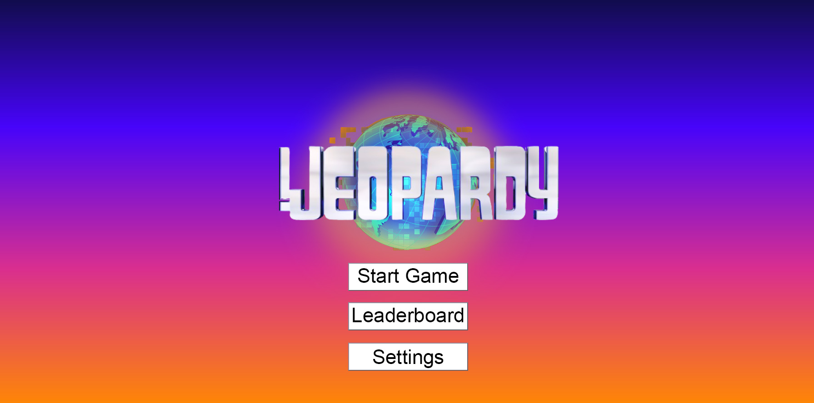
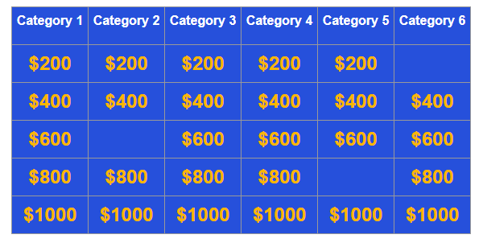
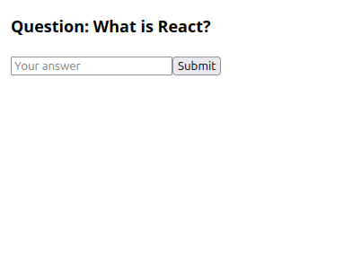
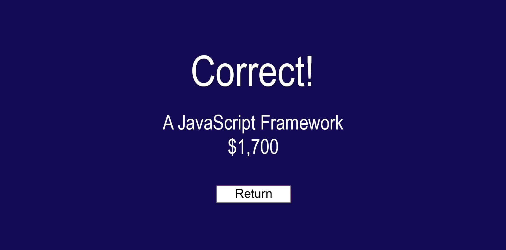
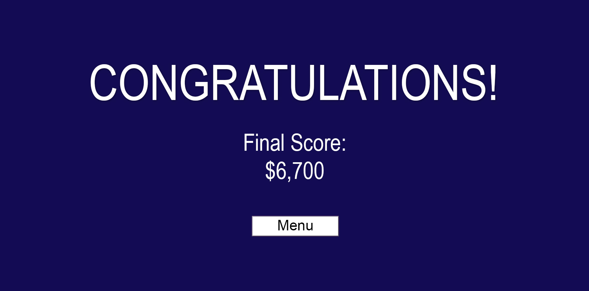
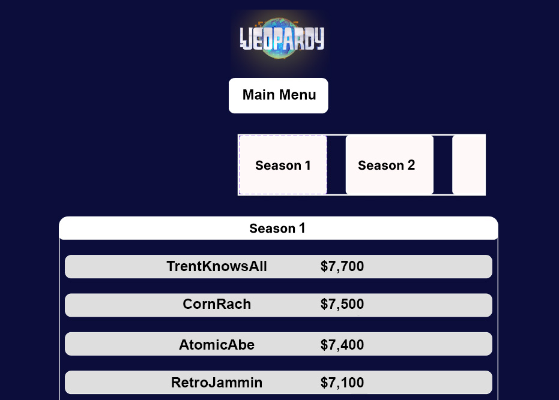

Pasting Moodle submission instructions for convenience

You will create a list of descriptions for the pages that will be implemented for your project.
You must add a file PAGE_TESTING.md to your repository and provide the following for each page (at least 5 independent pages):

    Page Title
    Page Description (include a mockup or hand drawn image of the page)
    Parameters needed for the page
    Data needed to render the page

    Link destinations for the page

    List of tests for verifying the rendering of the page

Submit a link to your document in your repository. (one submission per team)

## 1) Title Screen

### Page description 
This is the screen the player will see upon launching the game. It has the game's name, a textbox for Username, and an "Enter" button.

### Parameters needed
- username
- onStart

### Data needed to render
- Image of game logo
- username

### Link destinations:
onStart (to navigate to menu screen)

### List of tests:
- title image renders correctly
- "Start Game" appears
- clicking start button changes the screen
- does text input populate the text box

## 2) Main Menu

### Page Description
This is the main menu screen, which gives the player a couple of options to select from, including to start a game, view the leaderboard or alter the game settings.

### Parameters Needed
- startClick
- leaderboardClick
- settingsClick

### Data needed to render
Image of game logo

### Link Destinations: 
- startClick - Main Game
- leaderboardClick - Leaderboard
- settingsClick - Settings

## 3) Main Game

### Page description 
This is the screen the player will see after clicking the "Start Game" button on the Main Menu. A grid will be displayed in which there are 6 columns for categories, and 5 rows for each clue. The dollar amounts each clue is worth increases from top to bottom. Each cell is a button to click.

### Parameters needed
- onSelectQuestion
- tiles
- setTiles

### Data needed to render
Array of tiles, each tile's index

### Link destinations:
onSelectQuestion (navigate to Question Screen)

### List of tests:
- six categories in top row
- 30 tiles appear (6x5 grid)
- clicking a tile sets it to `null`
- clicking a tile changes the screen to the Question Screen

## 4) Question Screen

### Page description 
This screen appears after the player selects a clue from the Category Screen. There is a text-box for them to enter their answer and a clickable submit button next to it.

### Parameters needed
answerSubmit

### Data needed to render
- Local state `answer`
- Clue text

### Link destinations:
answerSubmit

### List of tests
- text renders
- input box appears and allows typing
- clicking "Submit" button stores the player input as a string (for validation by the backend) and transfers the player to the Answer validation screen

## 4) Answer Screen 

### Page Description
This page shows the player either "Correct" or "Incorrect" with the answer to the question to the question and the player's current score. There is a single button which will return the user to the Main Game screen upon pressing. 

### Parameters needed
onClick

### Data needed to render
- Current Score
- Answer to Question

### Link Destinations:
onClick - Main Game

### List of Tests
- Is player score accurate
- Is the displayed answer accurate

## 5) Game Over Screen

### Page description 
This page shows the player their score once the game is finished.

### Parameters needed
score

### Data needed to render
Player's score

### Link destinations
- "Menu" button to navigate to Main Menu Screen

### List of tests
- Page renders correctly
- Score has correct value
- clicking "Menu" transfers back to the Main Menu

## 6) Leaderboard

### Page Description
This page displays the players with top scores accumulated across games. There is a button to return to the main menu. 

### Parameters needed
None

### Data needed to render
Top player usernames
Top player scores

### Link Destinations
Main Menu button -> Main Menu

### List of Tests
- Do top players usernames and scores match manual database query