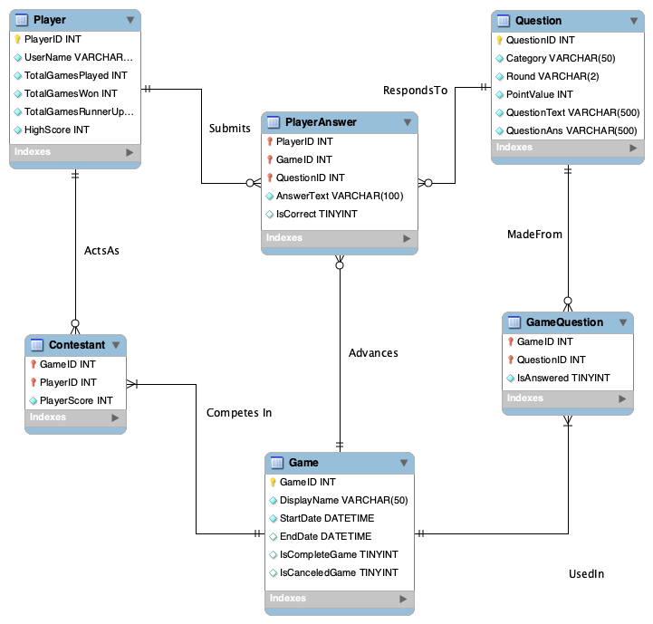

# SQL_TESTING: Database Schema for Not Applicable's !Jeopardy App

# Table Descriptions

---
## 1) Table Question

### Description
This strong entity contains all question, answers, and associated metadata sourced from [J-Archive](https://j-archive.com/). It has a one-to-many relationship with the weak entity GameQuestion wherein each QuestionID can be utilized on the game board of zero or more individual games.

### Attributes (incl. column & table constraints, where applicable)
- QuestionID INTEGER PRIMARY KEY
- GameCode VARCHAR(9) NOT NULL 
- Category VARCHAR(50) NOT NULL
- Round VARCHAR(2) NOT NULL
- PointValue INT NOT NULL
- QuestionText VARCHAR(500) NOT NULL
- QuestionAns VARCHAR(500) NOT NULL
- CONSTRAINT UniqueQ UNIQUE (QuestionText)

### List of Unit Tests for Constraint Validation
- test_Question_InsertRow

### Associated Data Access Methods 
### 1) extract_questions_data

### Description
- This function is called from initialize_game and extracts questions, answers, categories and point values from the Table Question. Each of these is then put into an array and passed to front end as a JSON from the backend driver code. 

### Parameters
- DB File Path 

### Return Values
- Category Array
- Question Array 
- Answer Array 
- Point Value Array

### Associated Tests
- Game_6692
- test_extract_game

---
## 2) Table Game

### Description
This strong entity contains one entry for each unique game instantiated by one or more player contestants. Its attributes capture game metadata like the date initiated and whether the game is in progress or completed. It has a one-to-many relationship with the weak entity GameQuestion that captures the set of QuestionIDs that populated the game boards of a specific GameID. Likewise, it has a one-to-many relationship with the weak entity Contestant that captures the PlayerIDs of all individual(s) that participated in a specific GameID. Finally, it has a one-to-many relationship with the weak entity PlayerAnswer that tracks which GameID a submitted PlayerAnwer corresponds to.

### Attributes (incl. column & table constraints, where applicable)
- GameID INTEGER PRIMARY KEY
- DisplayName VARCHAR(50) NOT NULL DEFAULT ('Game ' || strftime('%Y-%m-%d %H:%M:%S', 'now'))
- StartDate DATETIME NOT NULL DEFAULT (strftime('%Y-%m-%d %H:%M:%S', 'now'))
- EndDate DATETIME
- IsCompleteGame CHAR(1) DEFAULT 'N'
- IsCanceledGame CHAR(1) DEFAULT 'N'

### List of Unit Tests for Constraint Validation
- test_Game_CreateNewGame

### Data Access Methods
### 1) create_game_record

#### Description
- This function creates the Game Record entry in the Game table for the current game. Records the current time and inserts time, Game_Id and DisplayName into the Game Table with the rest of the entries as default values
  
#### Parameters
- db_file - PATH
- username - STRING
- Game_ID - INT 
 
#### Return Values
- None
  
#### Associated Tests
- test_Game_CreateNewGame

### 2) complete_game_record

#### Description
- This function completes the Game Record entry in the Game table for the current game. Records the current time and updates end time in the Game Table, marking the current game as complete
  
#### Parameters
- db_file - PATH
- Username - STRING
- GameID - INT
  
#### Return Values
- None
  
#### Associated Tests
- test_complete_game_record

---
## 3) Table Player

### Description
This strong entity contains one entry for each unique player who registers to play games in the application. It has a one-to-many relationship with the weak entity Contestant that tracks each of the zero or more games a player has participated in. It also has a one-to-any relationship with the weak entity PlayerAnswer that tracks each of the answers a player has submitted for each instance of a question in a game.

### Attributes (incl. column & table constraints, where applicable)
- PlayerID INTEGER PRIMARY KEY
- UserName VARCHAR(50) NOT NULL
- TotalGamesPlayed INT NOT NULL DEFAULT 0
- TotalGamesWon INT NOT NULL DEFAULT 0
- TotalGamesRunnerUp INT NOT NULL DEFAULT 0
- HighScore INT NOT NULL DEFAULT 0
- CONSTRAINT UniqueName UNIQUE (Username)

### List of Unit Tests for Constraint Validation
- test_Player_newPlayerSignup

### Data Access Methods

### 1) update_highscore

#### Description
- This function updates the Player Table upon the completion of a game. It creates an entry in the table if the playerid/username is not already present in the table and updates TotalGamesPlayed, TotalGamesWon, TotalGamesRunnerUp and HighScore.
  
#### Parameters
- Player Name - STRING
- GameID - INT 
- Score from the Game - INT 
- win - BOOLEAN
- runner_up - BOOLEAN
  
#### Return Values
- None
  
#### Associated Tests
- add_trentknowsall

### 2) add_players

#### Description
- This function adds usernames into the Player DB. Meant to be called on start of a new game and players need to be populated in the database.
  The other attributes of the Player Table are initialized to 0 
- Updates Contestant table to track participation in this Game - tracked via GameID 

#### Parameters
- db_file as PATH
- usernames as a list of STRINGs 
  
#### Return Values
- No return 
  
#### Associated Tests
- test_add_players
  - intializes list of dummy players and checks Player/Contestant table for proper entries

---
## 4) Table GameQuestion

### Description
This weak entity maps Questions (QuestionID) to the games (GameID) they have appeared in through foreign key relationships and is the means by which the database logs the contents of individual game boards. It also contains a metadata field that records whether a question has been answered and removed from the board.

### Attributes (incl. column & table constraints, where applicable)
- GameID INT
- QuestionID INT
- IsAnswered CHAR(1) NOT NULL DEFAULT 'N'
- CONSTRAINT GameLogFK FOREIGN KEY (GameID) REFERENCES Game (GameID) ON DELETE CASCADEON UPDATE CASCADE
- CONSTRAINT QuestionBankFK FOREIGN KEY (QuestionID) REFERENCES Question (QuestionID) ON DELETE CASCADE ON UPDATE CASCADE

### List of Unit Tests for Constraint Validation
- test_GameQuestion_SetupGameBoard
- test_GameQuestion_DropQuestionsOrGames

### Data Access Methods
This table was designed to disambiguate the games that a specific QuestionID is utilized in when multiple games draw from the same bank of questions. It is not accessed in the minimum viable product, which is strictly a one-player working instance of game-6692 created by directly querying table Question using the `db_api` function `extract_questions_data`.

---
## 5) Table PlayerAnswer

### Description
This weak entity maps answers submitted by specific players (PlayerID) to the specific gameboard (GameID) and Question (QuestionID) the individual was playing. It also contains metadata attributes to capture the text submitted and whether it was scored as correct by the backend answer evaluation function.

### Attributes (incl. column & table constraints, where applicable)
- PlayerID INT
- GameID INT
- QuestionID INT
- AnswerText VARCHAR(500) NOT NULL
- IsCorrect CHAR(1)
- CONSTRAINT AnsweringPlayerFK FOREIGN KEY (PlayerID) REFERENCES Player (PlayerID) ON DELETE CASCADE ON UPDATE CASCADE
- CONSTRAINT AnswerGameFK FOREIGN KEY (GameID) REFERENCES Game (GameID) ON DELETE CASCADE ON UPDATE CASCADE
- CONSTRAINT AnsweredQFK FOREIGN KEY (QuestionID) REFERENCES Question (QuestionID) ON DELETE CASCADE ON UPDATE CASCADE

### List of Unit Tests for Constraint Validation

### Data Access Methods
This table was designed to store individual answers for specific (PlayerID, GameID, QuestionID) combos for two primary reasons: 1) Maintenance of ACID compliance (specifically, Durable writes of in-progress game data to insure against power failures or service interruptions) and 2) Creation of player data that NotApplicable could analyze to improve gameplay experience (e.g., answer scoring algorithm improvements, identification of popular/unpopular trivia categories). These features are outside the scope of the Minimum Viable Product (a one-player playable instance of game_6692), and therefore this table is not accessed in the current build of the application.

---
## 6) Table Contestant

### Description
This weak entity maps players (PlayerID) to the games (GameID) they have participated in. It contains an additional attribute for tracking the player's score in each game.

### Attributes (incl. column & table constraints, where applicable)
- GameID INT
- PlayerID INT
- PlayerScore INT NOT NULL DEFAULT 0
- CONSTRAINT GameContestFK FOREIGN KEY (GameID) REFERENCES Game (GameID) ON DELETE CASCADE ON UPDATE CASCADE
- CONSTRAINT PlayerConstestFK FOREIGN KEY (PlayerID) REFERENCES Player (PlayerID) ON DELETE CASCADE ON UPDATE CASCADE

### List of Unit Tests for Constraint Validation
- test_Game_CreateNewContestant
- test_Contestant_DropPlayersOrGames

### Data Access Methods

### 1) reset_existing_player_score

#### Description
- sets player score back to zero in the Player table

#### Parameters
- cursor 
- username to reset score of as STRING 
  
#### Return Values
- No return 
  
#### Associated Tests
- test_reset_existing_player_score
  - inserts dummy player with score
  - resets score and verifies at zero

### 2) update_player_score

#### Description
- updates player score to new value in the Player table

#### Parameters
- db_file path
- username as STRING
- score as int 
  
#### Return Values
- player_score
  
#### Associated Tests
- test_update_player_score
  - inserts dummy player with score
  - updates score of dummy player and verifies entry in contestant table