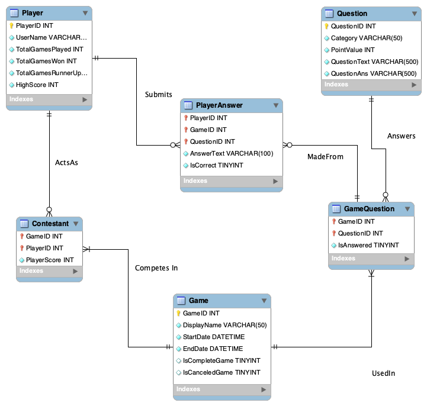

# SQL_TESTING: Database Schema for Not Applicable's !Jeopardy App

---
## 1) Table Question

### Description
This strong entity contains all question, answers, and associated metadata sourced from [J-Archive](https://j-archive.com/). It has a one-to-many relationship with the weak entity GameQuestion wherein each QuestionID can be utilized on the game board of zero or more individual games.

### Attributes (incl. column & table constraints, where applicable)
- QuestionID INTEGER PRIMARY KEY
- Category VARCHAR(50) NOT NULL
- RoundName VARCHAR(2) NOT NULL
- PointValue INT NOT NULL
- QuestionText VARCHAR(500) NOT NULL
- QuestionAns VARCHAR(500) NOT NULL
- CONSTRAINT UniqueQ UNIQUE (QuestionText)

### List of Unit Tests for Constraint Validation

### Data Access Methods

---
## 2) Table Game

### Description
This strong entity contains one entry for each unique game instantiated by one or more player contestants. Its attributes capture game metadata like the date initiated and whether the game is in progress or completed. It has a one-to-many relationship with the weak entity GameQuestion that captures the set of QuestionIDs that populated the game boards of a specific GameID. Likewise, it has a one-to-many relationship with the weak entity Contestant that captures the PlayerIDs of all individual(s) that participated in a specific GameID.

### Attributes (incl. column & table constraints, where applicable)
- GameID INTEGER PRIMARY KEY
- DisplayName VARCHAR(50) NOT NULL
- StartDate DATETIME NOT NULL
- EndDate DATETIME NOT NULL
- IsCompleteGame CHAR(1)
- IsCanceledGame CHAR(1)

### List of Unit Tests for Constraint Validation

### Data Access Methods

---
## 3) Table Player

### Description
This strong entity contains one entry for each unique player who registers to play games in the application. It has a one-to-many relationship with the weak entity Contestant that tracks each of the zero or more games a player has participated in. It also has a one-to-any relationship with the weak entity PlayerAnswer that tracks each of the answers a player has submitted for each instance of a question in a game.

### Attributes (incl. column & table constraints, where applicable)
- PlayerID INTEGER PRIMARY KEY
- UserName VARCHAR(50) NOT NULL
- TotalGamesPlayed INT NOT NULL
- TotalGamesWon INT NOT NULL
- TotalGamesRunnerUp INT NOT NULL
- HighScore INT NOT NULL
- CONSTRAINT UniqueName UNIQUE (Username)

### List of Unit Tests for Constraint Validation

### Data Access Methods

---
## 4) Table GameQuestion

### Description
This weak entity maps Questions (QuestionID) to the games (GameID) they have appeared in through foreign key relationships and is the means by which the database logs the contents of individual game boards. It also contains a metadata field that records whether a question has been answered and removed from the board.

### Attributes (incl. column & table constraints, where applicable)
- GameID INT
- QuestionID INT
- IsAnswered CHAR(1) NOT NULL
- CONSTRAINT GameLogFK FOREIGN KEY (GameID) REFERENCES Game (GameID) ON DELETE CASCADEON UPDATE CASCADE
- CONSTRAINT QuestionBankFK FOREIGN KEY (QuestionID) REFERENCES Question (QuestionID) ON DELETE CASCADE ON UPDATE CASCADE

### List of Unit Tests for Constraint Validation

### Data Access Methods

---
## 5) Table PlayerAnswer

### Description
This weak entity maps answers submitted by specific players (PlayerID) to the specific gameboard (GameID, QuestionID) the individual was playing. It also contains metadata attributes to capture the text submitted and whether it was scored as correct by the backend answer evaluation function.

### Attributes (incl. column & table constraints, where applicable)
- PlayerID INT
- GameID INT
- QuestionID INT
- AnswerText VARCHAR(500) NOT NULL
- IsCorrect CHAR(1) NOT NULL
- CONSTRAINT AnsweringPlayerFK FOREIGN KEY (PlayerID) REFERENCES Player (PlayerID) ON DELETE CASCADE ON UPDATE CASCADE
- CONSTRAINT AnswerGameFK FOREIGN KEY (GameID) REFERENCES GameQuestion (GameID) ON DELETE CASCADE ON UPDATE CASCADE
- CONSTRAINT AnsweredQFK FOREIGN KEY (QuestionID) REFERENCES GameQuestion (QuestionID) ON DELETE CASCADE ON UPDATE CASCADE

### List of Unit Tests for Constraint Validation

### Data Access Methods

---
## 6) Table Contestant

### Description
This weak entity maps players (PlayerID) to the games (GameID) they have participated in. It contains an additional attribute for tracking the player's score in each game.

### Attributes (incl. column & table constraints, where applicable)
- GameID INT
- PlayerID INT
- PlayerScore INT NOT NULL
- CONSTRAINT GameContestFK FOREIGN KEY (GameID) REFERENCES Game (GameID) ON DELETE CASCADE ON UPDATE CASCADE
- CONSTRAINT PlayerConstestFK FOREIGN KEY (PlayerID) REFERENCES Player (PlayerID) ON DELETE CASCADE ON UPDATE CASCADE

### List of Unit Tests for Constraint Validation

### Data Access Methods
