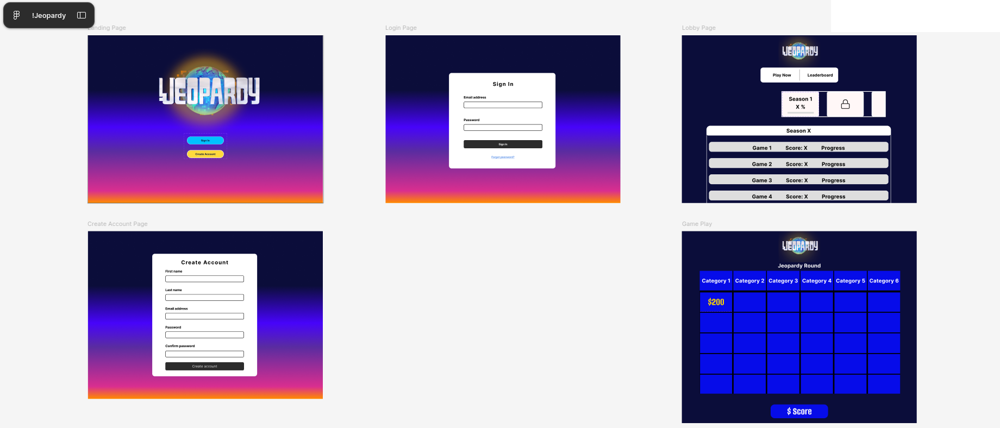
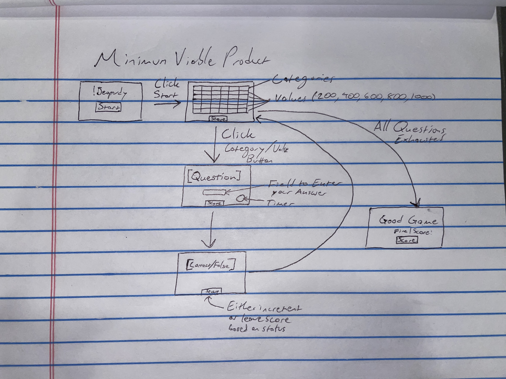
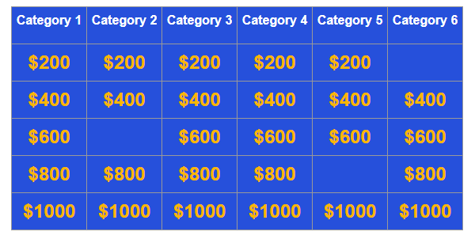

# Team: 'Not Applicable'   Members: Ebrahim Azarisooreh, RJ Barrett, Darvin Conttreras, Rachel Mertz, Trent Rivers, Megan Yeung

#### TEAM NOTE: for screenshots in markdown, please store and reference them from the ./img directory (if uploaded directly to this file you'll have to use png or jpeg) 

# Weekly Status Updates

### Week of October 5, 2025

#### Jira Snapshot: 

#### 10/5 RJ's updates:

Built out a high level flow diagram depicting the flow of function calls between the frontend-backend and backend-database. We plan to use this as a baseline for identifying portions of the MVP.
PLan for this coming week is to built out functions for the MVP of displaying a single question block on the frontend and getting the data flow for one block/question/answer correct before scaling
up to multiple questions. Plan is to utilize a dummy question/answer for testing for now while the database is built out and connect later. 

#### 10/5 Ebrahim's updates:
Added initial infrastructure using a flask service backend to communicate game state between the backend/DB and the frontend, in order to facilitate progress through the game as well as
informed rendering for the frontend for clear separation of logic and duties. The template is currently stored in src/backend/core.py

#### Front-end

Darvin's Figma might not work out due to free trial limitations; 
however, the mock-up from Figma might still be useful to refer to for 
design ideas. 

Trent drew a high-level sketch of the game's flow. He also added a 
front-end directory and started a corresponding Git branch.
Front-end team had decided to use React to build our game's front-end.

Our game has a title screen with the !Jeopardy name and a 'Start Game'
button. Experimenting with adding a background and modifying fonts of
this page. Clicking the start button transitions to the category board 
with dollar amounts on a functioning grid of buttons. 
