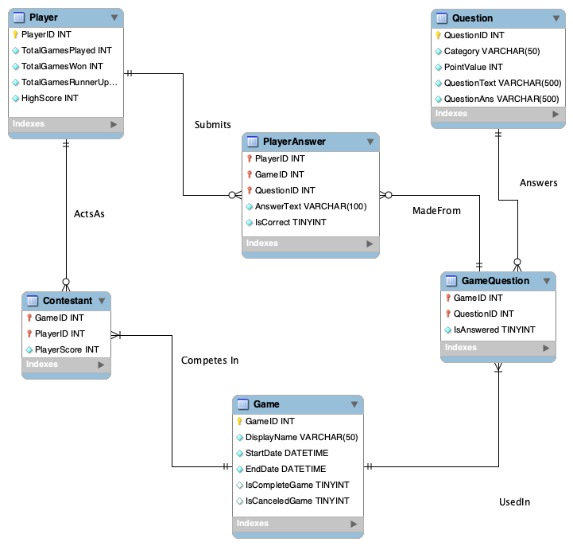

# Team: 'Not Applicable'   Members: Ebrahim Azarisooreh, RJ Barrett, Darvin Conttreras, Rachel Mertz, Trent Rivers, Megan Yeung

#### TEAM NOTE: for screenshots in markdown, please store and reference them from the ./img directory (if uploaded directly to this file you'll have to use png or jpeg) 

# Weekly Status Updates

### Week of October 5, 2025

#### Jira Snapshot: 

#### 10/5 RJ's updates:

Built out a high level flow diagram depicting the flow of function calls between the frontend-backend and backend-database. We plan to use this as a baseline for identifying portions of the MVP.
PLan for this coming week is to built out functions for the MVP of displaying a single question block on the frontend and getting the data flow for one block/question/answer correct before scaling
up to multiple questions. Plan is to utilize a dummy question/answer for testing for now while the database is built out and connect later. 

#### 10/5 Ebrahim's updates:
Added initial infrastructure using a flask service backend to communicate game state between the backend/DB and the frontend, in order to facilitate progress through the game as well as
informed rendering for the frontend for clear separation of logic and duties. The template is currently stored in src/backend/core.py

#### 10/5 Front-end Team Updates (Darvin, Megan, Trent)

Darvin's Figma might not work out due to free trial limitations; 
however, the mock-up from Figma might still be useful to refer to for 
design ideas. 

Trent drew a high-level sketch of the game's flow. He also added a 
front-end directory and started a corresponding Git branch.
Front-end team had decided to use React to build our game's front-end.

#### 10/5 Database updates (Rachel's update):
Finished a draft entity relationship diagram suitable for implementation in any RDBMS software. Although this diagram was created in MySQL Workbench and has attribute datatypes that correspond to MySQL, I've decided to use SQLite for MVP implementation due to its portability and light requirements for database administration. The datatypes represented here are strings, integers, and booleans represented as integers, all of which are also supported in SQLite.

The initial plan for this week was to proceed to scraping, uploading, and testing of Game_6692 to create a prototype database, but this work will be postponed to the 10/12 update due to time constraints.

### Week of October 12, 2025

#### Trent's updates:
Implemented the main game flow in React. Upon opening the application, the user is presented with a Start Game screen. Upon clicking the button, the user is taken to the main game board. If the user clicks a tile, they are prompted with a question with an input box. The user input is taken in as a string in Javascript and printed to the console.  

Our game has a title screen with the !Jeopardy name and a 'Start Game'
button. Experimenting with adding a background and modifying fonts of
this page. 
